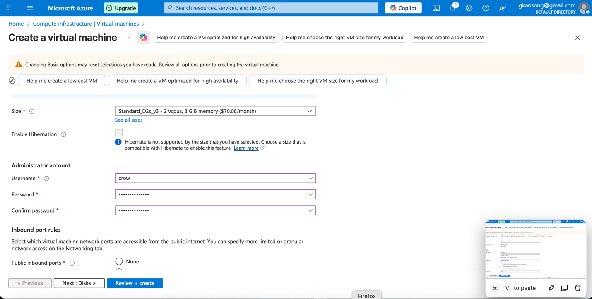

# **Azure SIEM Home Lab** 

**Project:** Bevo SIEM Home Lab - Azure and PowerShell Collectors

**Summary**

A SIEM (Security Information and Event Management) system helps detect, analyze, and respond to security threats before they can impact business operations. It collects and correlates event log data from across a network including firewalls, intrusion detection systems (IDS/IPS), authentication servers, and endpoints, giving security teams real-time visibility into suspicious activity.

A honeypot is a purposely vulnerable system designed to attract attackers in a controlled, monitored environment. By observing how attackers interact with the honeypot, defenders can learn about attack methods, new exploits and improve their defensive strategies.

In this project, the goal is to collect honeypot attack logs, ingest them into a SIEM, and visualize the results on a world map by event count and geolocation. This provides an easy-to-understand view of where attacks are coming from and how frequently they occur.

**Purpose:** This repository documents a reproducible home-lab build used for a security engineering project and résumé portfolio. It shows how I deployed a small Azure environment, collected Windows login events with custom PowerShell collectors, ingested logs into Azure Log Analytics (Microsoft Sentinel), implemented detections (KQL), and visualized attack data. This document is written as a project case study suitable for GitHub and resume inclusion.

## **Introduction**

This project demonstrates a compact, repeatable approach to building a home Security Information and Event Management (SIEM) lab using Microsoft Azure and PowerShell. The lab focuses on detecting login-related threats (failed logons, brute force, credential stuffing) and correlating them with network indicators for triage and visualization.

**Learning objectives**

- Configuration & Deployment of Azure resources such as virtual machines, Log Analytics Workspaces, and Azure Sentinel.

- Hands-on experience and working knowledge of a SIEM Log Management Tool (Microsoft's Azure Sentinel)

- Understand Windows Security Event logs

- Utilization of KQL to query logs

- Display attack data on a dashboard with Workbooks (World Map) for incident triage

## **Phase 1. Setting Up Azure Resources**

1.  I signed in to the Azure Portal because it’s the main web interface for creating and managing all your Azure resources

2.  After getting a subscription (Azure Subscription 1), I created a resource group which will hold all the resources related to a specific project. The following steps were followed.

    - Navigate to Resource Groups → + Create

    - Name: BevoSOCLab

    - Region: East US 2

    - Review + Create.

3.  I then created a Log Analytics Workspace which is the central data storage and analysis hub in Azure where logs from different sources are collected, stored, and analyzed. It’s an essential part of building a SIEM solution with Microsoft Sentinel or any custom log collection pipeline. These are the parameters followed:

    - Navigate to Log Analytics workspaces → + Create

    - Workspace Name: law_bevo

    - Resource Group: BevoSOCLab

    - Region: East US 2

    - Pricing Tier: Free or Per GB

    - Review + Create.

## **Phase 2. Creating the Windows 10 Virtual Machine**

1.  I navigated to Virtual Machines → + Create → Azure Virtual Machine.

2.  Filled in the basic settings:

    - Subscription: Azure subscription 1

    - Resource Group: BevoSOCLab

    - Virtual Machine Name: crowvm

    - Region: East US 2

    - Image: Windows 10 Pro, version 22H2

    - Size: Standard_D2s_v3 - 2 vcpus, 8 GiB memory (\$70.08/month)

3.  Administrator Account:

    - Username: crow

    - Password: chosed a strong password

4.  IMPORTANT NOTE: These credentials will be used to log into the virtual machine

5.  In Inbound Port Rules:

    - Open RDP (3389) for your public IP only

6.  Licensing

- Confirm licensing

- Select Next : Disks \>

7.  Networking

- NIC network security group: Advanced \> Create new

A network security group contains security rules that allow or deny inbound network traffic to, or outbound network traffic from, the virtual machine. In other words, security rules management.

- I removed Inbound rules (1000: default-allow-rdp) by clicking three dots

- Added an inbound rule

- Destination port ranges: \* (wildcard for anything)

- Protocol: Any

- Action: Allow

- Priority: 100 (low)

Name: Anything (Danger_Any_Inbound)

8.  Review + Create and wait for deployment.

**Key steps**

- I created a resource group in `East US`` 2` to minimize latency and match the workspace region.

- Deployed VMs with NSG rules restricting RDP/SSH to my public IP.

## **Phase 3. Configuring Log Analytics Workspace**

1.  I opened the crow VM in Azure Portal.

2.  Navigated to Insights → Connect to Log Analytics Workspace.

3.  Selected the workspace BevoSOCLab.

4.  Ensured the VM is reporting correctly by checking VM Insights → Overview → Connected.

**Why:** The workspace is the ingestion point for custom logs and it is used by Microsoft Sentinel for detection, hunting, and visualization.

## **Phase 4. Configuring Microsoft Defender for Cloud**

Microsoft Defender for Cloud is a cloud-native security posture management (CSPM) and threat protection solution built into Azure. Configuring it in your SIEM home lab adds an extra layer of defense and visibility** **across your resources.

Below are the configurations I used:

**Settings \| Defender plans**

- Cloud Security Posture Management: ON

- Servers: ON

- SQL servers on machines: OFF

- Hit Save

**Settings \| Data collection**

- Select "All Events"

- Hit Save

**Actions performed**

- Enabled Microsoft Defender for Cloud (Server & VM plans) to improve posture and surface host recommendations.

- Applied Just-in-Time VM Access where applicable and reviewed secure score suggestions.

**Note:** Defender features can incur charges; evaluate cost before enabling in non-trial subscriptions.

## **Phase 5. Integrating Microsoft Sentinel SIEM**

1.  Navigated to Microsoft Sentinel → + Add

2.  Selected the workspace BevoSOCLab.

3.  Enabled Data Connectors as needed (Windows Security Events, Syslog optional).

4.  Verified events are being collected via Logs → Run a simple query.

**Phase 6. Disable the Firewall in Virtual Machine**

In this home lab, the purpose of the virtual machine is to simulate a vulnerable endpoint** **and capture security events (such as failed logins or attempted intrusions) that can be forwarded to the SIEM for analysis. Disabling the Windows Firewall temporarily helps achieve that goal under controlled conditions.

- I went to Virtual Machines to find the honeypot VM (crowvm)

- I copied the VM IP address by clicking on the VM

- Then I logged into the VM via Remote Desktop Protocol (RDP) with credentials from Phase 2

- I accepted certificate warning

- Selected NO for all Choose privacy settings for your device

- Clicked Start and search for "wf.msc" (Windows Defender Firewall)

- Clicked "Windows Defender Firewall Properties"

- Turned Firewall State OFF for Domain Profile Private Profile and Public Profile

- Hit Apply and Ok

- I pinged VM via Host's command line to make sure it is reachable (ping 9.169.254.135)

**Phase 7: Scripting the Security Log Exporter**

The goal is to automate the collection and forwarding of Windows Security Event Logs (e.g., login attempts, failed authentications, privilege escalations) to your Azure Log Analytics Workspace. Instead of manually exporting logs or relying only on built-in agents, scripting the process with PowerShell provides flexibility, control, and learning value**.**

- In VM, I opened Powershell ISE

- Set up Edge without signing in

- Copied the [Powershell script](https://github.com/joshmadakor1/Sentinel-Lab/blob/main/Custom_Security_Log_Exporter.ps1) into VM's Powershell (Written by Pedro Odeja)

- I selected New Script in Powershell ISE and paste script

- Saved it to Desktop and give it a name Custom_Security_Log_Exporter.ps1

- Made an account with [Free IP Geolocation API and Accurate IP Lookup Database](https://ipgeolocation.io/)

This account is free for 1000 API calls per day. Paying 15.00\$ will allow 150,000 API calls per month.

- I copied the API key once logged in and paste into script line 2: \$API_KEY = "\<API key\>"

- Hit Save

- I ran the PowerShell ISE script (Green play button) in the virtual machine to continuously produce log data

The script will export data from the Windows Event Viewer to then import into the IP Geolocation service. It will then extract the latitude and longitude and then create a new log called failed_rdp.log in the following location: C:\ProgramData\failed_rdp.log

**Phase 8: Create Custom Log in Log Analytics Workspace**

In this SIEM home lab, the goal is to ingest specific security data such as Windows login attempts, honeypot activity, or custom PowerShell script outputs that aren’t captured by default Azure monitoring agents.  
Creating a Custom Log in the Azure Log Analytics Workspace allows you to store, query, and visualize this unique data directly inside Microsoft Sentinel.

- I created a custom log to import the additional data from the IP Geolocation service into Azure Sentinel

- Searched "Run" in VM and type "C:\ProgramData"

- Opened file named "failed_rdp.log" hit CTRL + A to select all and CTRL + C to copy selection

- Opened notepad on Host PC and paste contents

- Saved to desktop as "failed_rdp.log"

- In Azure go to Log Analytics Workspaces \> Log Analytics workspace name (law-bevo) \> Custom logs \> Add custom log

<!-- -->

- Selected Sample log saved to Desktop (failed_rdp.log) and hit Next

<!-- -->

- Reviewed sample logs in Record delimiter and hit Next

<!-- -->

- Type \> Windows

- Path \> "C:\ProgramData\failed_rdp.log"

<!-- -->

- Gave the custom log a name and provide description (FAILED_RDP_WITH_GEO) and hit Next

- Hit Create

## 

## 

## 

## 

## 

**Phase 9: Query the Custom Log**

- In Log Analytics Workspaces I navigated to the created workspace (law-bevo) \> Logs

- Ran a query to see the available data (FAILED_RDP_WITH_GEO_CL)

## 

## 

## 

## **Phase 10: Extract Fields from Custom Log**

The RawData within a log contains information such as latitude, longitude, destination host, etc. Data will have to be extracted to create separate fields for the different types of data

- I right clicked any of the log results

- Selected Extract fields from 'FAILED_RDP_WITH_GEO_CL'

- Highlighted ONLY the value after the ":"

- Named the Field Title the name of the field of the value

- Under Field Type I selected the appropriate data type

- Hit Extract

- I clicked the Save extraction button as the search results data looks good

- I did this for ALL available fields in RawData

## **Phase 11: Map Data in Microsoft Sentinel**

Once logs from your virtual machine and PowerShell collectors are ingested into your Log Analytics Workspace, the next crucial step is to visualize the attack data. Mapping data in Microsoft Sentinel transforms raw log entries into geographical, time-based, and trend-driven insights that make threat analysis faster and more intuitive.

- I navigated to Microsoft Sentinel to see the Overview page and available events

- I then clicked on Workbooks and Added workbook then click Edit

- Removed default widgets (Three dots \> Remove)

- Clicked Add \> Add query

- Copied/Pasted the query into the query window and Ran Query

Kusto Query Language (KQL) - Azure Monitor Logs is based on Azure Data Explorer. The language is designed to be easy to read and use with some practice writing queries and basic guidance.

- Once results came up, I clicked the Visualization dropdown menu and selected Map

- Selected Map Settings for additional configuration

#### 

#### Layout Settings

- Location info using \> Latitude/Longitude

- Latitude** **\> latitude_CF

- Longitude \> longitude_CF

- Size by \> event_count

#### Color Settings

- Coloring Type**:** Heatmap

- Color by \> event_count

- Aggregation for color \> Sum of values

- Color palette \> Green to Red

#### Metric Settings

- Metric Label \> label_CF

- Metric Value \> event_count

- Select Apply button and Save and Close

- Save as "Failed RDP World Map" in the same region and under the resource group (BevoSOCLab)

- Continue to refresh map to display additional incoming failed RDP attacks

## **Phase 12: Deprovision Resources**

Once the SIEM home lab had been successfully configured, tested, and documented, it was important to deprovision (delete or stop) the Azure resources. Deprovisioning ensures that the environment remains secure, cost-efficient, and compliant after the project is complete.

- Searched for "Resource groups" \> name of resource group (BevoSOCLab) \> Deleted resource group

- Typed the name of the resource group ("BevoSOCLab") to confirm deletion

- Checked the Apply force delete for selected Virtual machines and Virtual machine scale sets box

- Selected Delete

## **Phase 13. Project Deliverables (what’s included in this repository)**

- `README.md` (Bevo SIEM Home Lab)
- `scripts/``failed``_``rdp``.ps1` — Custom Security Log Exporter
- `scripts/``azure_heat_map` — Custom Azure Heat Map
- `scripts/``sentinel_log` — installs the collector as a scheduled task
- `kql/` — saved queries and analytics rule examples
- `workbooks/` — sample workbook JSON templates for Sentinel visualizations
